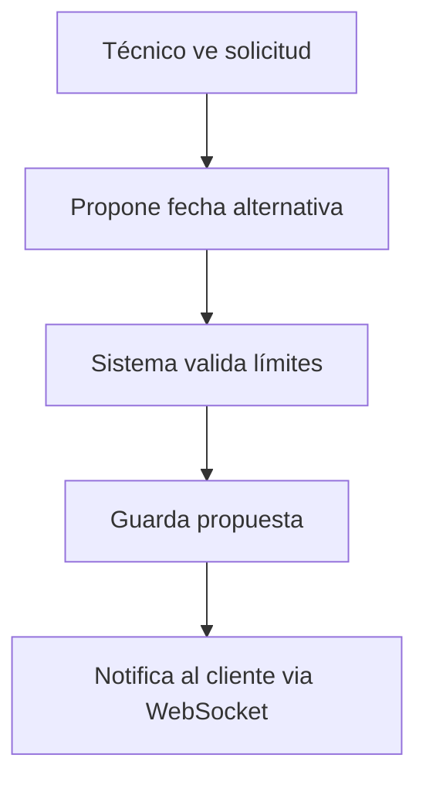
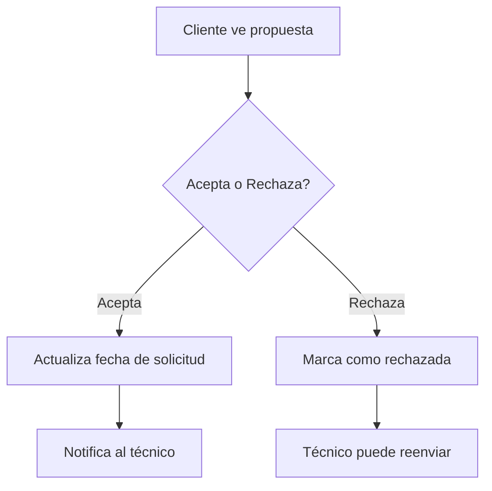

# 🏠 MyHomeTech - Sistema de Propuestas de Fechas Alternativas

## ✅ IMPLEMENTACIÓN COMPLETADA

### 🎯 Objetivo Alcanzado
El cliente puede gestionar completamente las propuestas de fechas alternativas enviadas por los técnicos para cada solicitud de servicio.

## 🚀 Funcionalidades Implementadas

### 📱 Para el Cliente:
1. **Ver propuestas por solicitud**: Las propuestas aparecen organizadas bajo cada solicitud
2. **Aceptar propuestas**: Actualiza automáticamente la fecha de la solicitud
3. **Rechazar propuestas**: Permite al técnico enviar nuevas propuestas
4. **Estados visuales claros**: Pendiente, Aceptada, Rechazada con colores distintivos
5. **Información completa**: Fecha/hora propuesta, comentarios del técnico, historial

### 🔧 Para el Técnico:
1. **Proponer fechas**: Hasta 3 propuestas por solicitud
2. **Ver estado de propuestas**: En la sección "Mis Trabajos"
3. **Reenvío de propuestas**: Si una es rechazada, puede enviar otra
4. **Comentarios explicativos**: Puede agregar comentarios a sus propuestas

### ⚙️ Validaciones del Sistema:
1. **Límite de propuestas**: Máximo 3 por técnico por solicitud
2. **Validación de horarios**: Evita conflictos de agenda
3. **Estados consistentes**: Solo propuestas pendientes pueden gestionarse
4. **Aceptación exclusiva**: Al aceptar una, las demás se rechazan automáticamente

## 📊 Estructura Técnica

### Backend (NestJS)
```
📁 service-request/
├── 📄 alternative-date-proposal.entity.ts      # Entidad principal
├── 📄 dto/propose-alternative-date.dto.ts      # DTO para validación
├── 📄 service-request.service.ts               # Lógica de negocio
├── 📄 service-request.controller.ts            # Endpoints REST
└── 📄 service-request.gateway.ts               # WebSocket notifications
```

### Frontend (React + TypeScript)
```
📁 components/
├── 📄 AlternativeDateProposalCard.tsx          # Tarjeta de propuesta
├── 📄 dashboards/ClientRequests.tsx           # Vista del cliente
├── 📄 dashboards/TechnicianJobs.tsx           # Vista del técnico
└── 📄 dashboards/Dashboard.tsx                # Dashboard principal

📁 hooks/
└── 📄 useDashboardActions.ts                  # Acciones del dashboard

📁 services/
└── 📄 serviceRequestService.ts                # API client

📁 types/
└── 📄 index.ts                                # Tipos TypeScript
```

## 🔄 Flujo de Trabajo

### 1. Técnico Propone Fecha


### 2. Cliente Gestiona Propuesta


## 📋 Endpoints API

### Técnico (Proponer)
- `POST /api/service-requests/:id/propose-alternative-date`
- `GET /api/service-requests/technician/alternative-date-proposals`

### Cliente (Gestionar)
- `POST /api/service-requests/proposals/:proposalId/accept`
- `POST /api/service-requests/proposals/:proposalId/reject`
- `GET /api/service-requests/:id/alternative-date-proposals`

## 🎨 Interfaz de Usuario

### Para el Cliente:
- **Tarjetas de propuesta** con información clara
- **Botones de acción** intuitivos (Aceptar/Rechazar)
- **Estados visuales** con colores distintivos
- **Información del técnico** y comentarios
- **Historial de propuestas** ordenado cronológicamente

### Para el Técnico:
- **Vista de propuestas enviadas** en "Mis Trabajos"
- **Estados de propuestas** claramente visibles
- **Formulario de propuesta** con validaciones

## 🔔 Notificaciones en Tiempo Real

Via WebSocket:
- Cliente recibe notificación de nueva propuesta
- Técnico recibe notificación de aceptación/rechazo
- Actualizaciones automáticas de estado

## 🧪 Casos de Prueba Cubiertos

1. ✅ Técnico propone fecha → Cliente recibe notificación
2. ✅ Cliente acepta → Fecha se actualiza, otras propuestas se rechazan
3. ✅ Cliente rechaza → Técnico puede enviar nueva propuesta
4. ✅ Límite de 3 propuestas por técnico
5. ✅ Validación de conflictos de horario
6. ✅ Propuestas solo para solicitudes apropiadas

## 🎯 Beneficios Logrados

1. **Flexibilidad de horarios**: Cliente y técnico pueden acordar fechas mutuamente convenientes
2. **Reducción de cancelaciones**: Negociación previa evita problemas de agenda
3. **Transparencia**: Historial completo de propuestas y decisiones
4. **Eficiencia**: Proceso automatizado sin necesidad de llamadas telefónicas
5. **Satisfacción del usuario**: Interfaz intuitiva y estados claros

## 🚀 Listo Para Producción

- ✅ Validaciones completas
- ✅ Manejo de errores robusto
- ✅ Estados de carga para UX
- ✅ Notificaciones en tiempo real
- ✅ Interfaz responsive
- ✅ Tipos TypeScript completos
- ✅ Documentación API
- ✅ Migraciones de base de datos

---

**¡El sistema de propuestas de fechas alternativas está 100% funcional y listo para uso!** 🎉

Los clientes ahora pueden gestionar eficientemente todas las propuestas de fechas que reciban de los técnicos, proporcionando una experiencia fluida y profesional en MyHomeTech.
