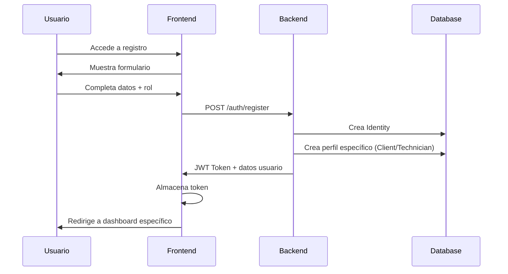
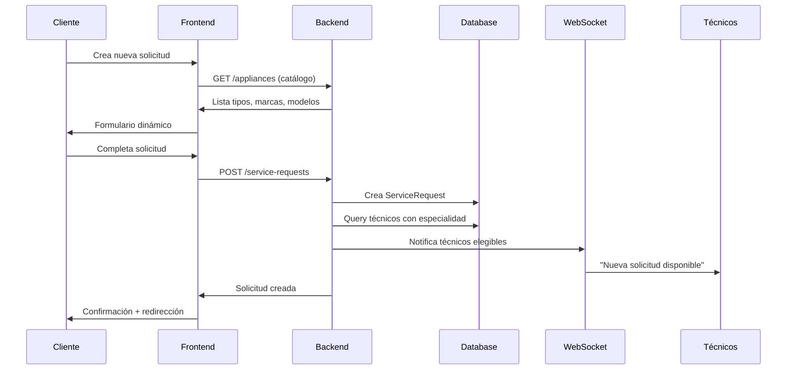
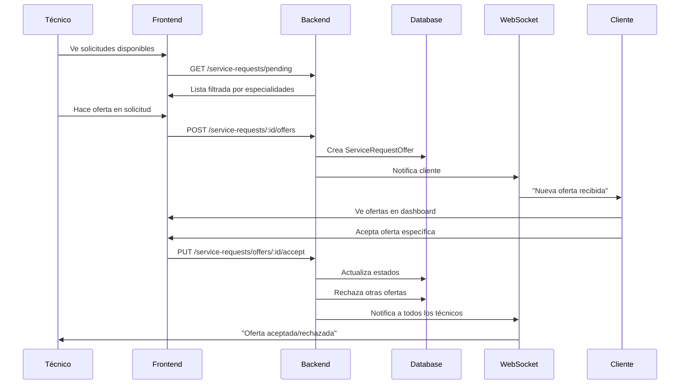
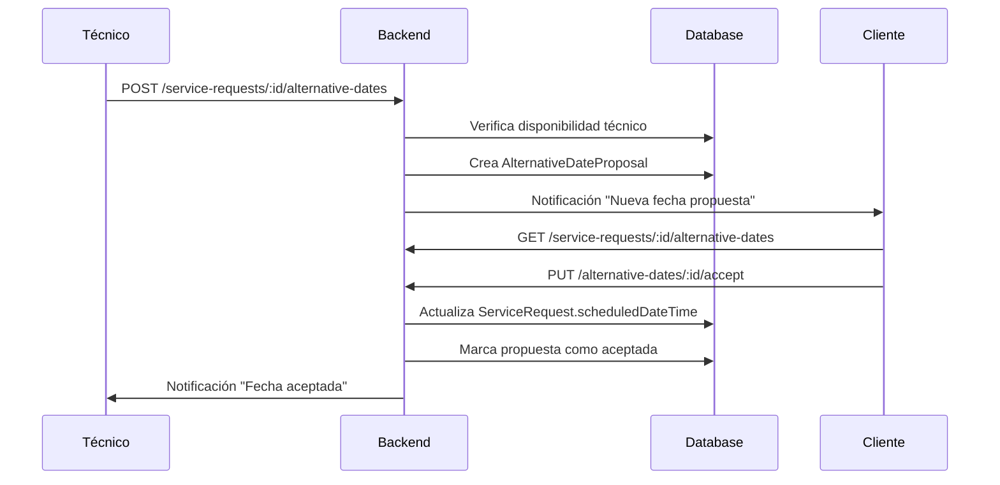
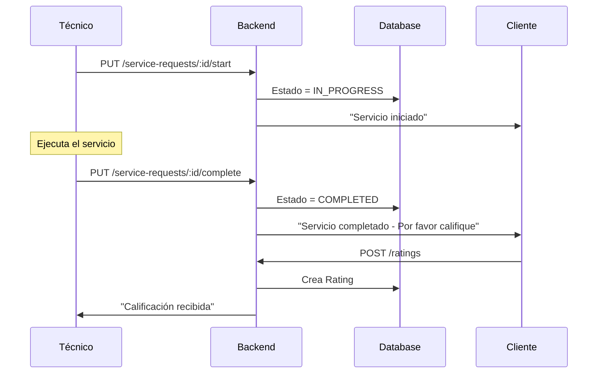

# MyHomeTech - Flujo Completo del Proceso y Documentación Técnica 🏠⚡

## 📋 Tabla de Contenidos
1. [Descripción General del Proyecto](#descripción-general-del-proyecto)
2. [Arquitectura del Sistema](#arquitectura-del-sistema)
3. [Stack Tecnológico y Justificaciones](#stack-tecnológico-y-justificaciones)
4. [Flujo Completo del Proceso de Negocio](#flujo-completo-del-proceso-de-negocio)
5. [Estructura de la Base de Datos](#estructura-de-la-base-de-datos)
6. [Flujo de Autenticación y Autorización](#flujo-de-autenticación-y-autorización)
7. [Sistema de Notificaciones en Tiempo Real](#sistema-de-notificaciones-en-tiempo-real)
8. [Gestión de Archivos e Imágenes](#gestión-de-archivos-e-imágenes)
9. [Patrones de Diseño Implementados](#patrones-de-diseño-implementados)
10. [Documentación JSDoc](#documentación-jsdoc)
11. [Consideraciones de Escalabilidad](#consideraciones-de-escalabilidad)

---

## 🎯 Descripción General del Proyecto

**MyHomeTech** es una plataforma completa de servicios de mantenimiento de electrodomésticos que conecta clientes con técnicos especializados. El sistema permite a los clientes solicitar servicios técnicos y a los técnicos ofrecer sus servicios de manera eficiente a través de un sistema multi-ofertas.

### Objetivos Principales:
- ✅ Conectar clientes con técnicos especializados
- ✅ Gestionar solicitudes de servicio de manera eficiente
- ✅ Proporcionar un sistema de calificaciones y reputación
- ✅ Mantener comunicación en tiempo real
- ✅ Gestionar múltiples direcciones de servicio
- ✅ Ofrecer un catálogo completo de electrodomésticos

---

## 🏗️ Arquitectura del Sistema

### Arquitectura General
El proyecto implementa una **arquitectura monorepo** con separación clara entre frontend y backend:

```
my-home-tech/
├── apps/
│   ├── backend/     # API REST + WebSocket (NestJS)
│   └── frontend/    # SPA React + TypeScript
├── package.json     # Workspace principal
└── shared/         # Tipos y utilidades compartidas
```

### Patrones Arquitectónicos Implementados:

#### 1. **Modular Monolith (Backend)**
- Cada funcionalidad está encapsulada en módulos independientes
- Separación clara de responsabilidades
- Facilita el mantenimiento y testing

#### 2. **Component-Based Architecture (Frontend)**
- Componentes reutilizables y especializados
- Separación entre lógica de negocio y presentación
- Hooks personalizados para lógica compartida

#### 3. **Repository Pattern**
- Abstracción de acceso a datos con TypeORM
- Servicios que encapsulan lógica de negocio
- DTOs para validación y transferencia de datos

---

## 🚀 Stack Tecnológico y Justificaciones

### Backend Stack

#### **NestJS 11.x** - Framework Principal
**¿Por qué NestJS?**
- ✅ **Arquitectura Modular**: Facilita la organización del código en módulos independientes
- ✅ **TypeScript Nativo**: Type safety desde el desarrollo hasta producción
- ✅ **Decoradores y DI**: Inyección de dependencias robusta similar a Angular
- ✅ **Integración con Express**: Rendimiento y ecosistema maduro
- ✅ **Swagger Automático**: Documentación de API generada automáticamente
- ✅ **Testing Built-in**: Herramientas de testing integradas

#### **PostgreSQL** - Base de Datos
**¿Por qué PostgreSQL?**
- ✅ **Relaciones Complejas**: Manejo eficiente de relaciones entre entidades
- ✅ **ACID Compliance**: Garantiza consistencia de datos críticos
- ✅ **JSON Support**: Flexibilidad para datos semi-estructurados
- ✅ **Escalabilidad**: Manejo eficiente de gran volumen de datos
- ✅ **Open Source**: Sin costos de licencia

#### **TypeORM 0.3.x** - ORM
**¿Por qué TypeORM?**
- ✅ **TypeScript First**: Integración nativa con TypeScript
- ✅ **Active Record + Data Mapper**: Flexibilidad en patrones de acceso a datos
- ✅ **Migrations**: Control de versiones de esquema de BD
- ✅ **Eager/Lazy Loading**: Optimización de consultas
- ✅ **Decoradores**: Sintaxis declarativa para entidades

#### **JWT + Passport** - Autenticación
**¿Por qué JWT?**
- ✅ **Stateless**: No requiere almacenamiento de sesiones en servidor
- ✅ **Escalable**: Funciona bien en arquitecturas distribuidas
- ✅ **Cross-platform**: Compatible con web, mobile, etc.
- ✅ **Roles Integration**: Fácil implementación de autorización basada en roles

#### **Socket.IO** - WebSockets
**¿Por qué Socket.IO?**
- ✅ **Real-time**: Notificaciones instantáneas
- ✅ **Fallback Support**: Compatibilidad con navegadores antiguos
- ✅ **Room Management**: Agrupación eficiente de conexiones
- ✅ **Event-driven**: Arquitectura basada en eventos

#### **Cloudinary** - Gestión de Imágenes
**¿Por qué Cloudinary?**
- ✅ **Optimización Automática**: Compresión y formato automático
- ✅ **CDN Global**: Entrega rápida de imágenes
- ✅ **Transformaciones**: Redimensionado automático
- ✅ **Backup Automático**: Redundancia y seguridad

### Frontend Stack

#### **React 19** - Framework UI
**¿Por qué React 19?**
- ✅ **Virtual DOM**: Rendimiento optimizado
- ✅ **Component Ecosystem**: Amplio ecosistema de componentes
- ✅ **Hooks**: Gestión de estado moderna y funcional
- ✅ **React Concurrent Features**: Mejoras de rendimiento

#### **TypeScript** - Lenguaje
**¿Por qué TypeScript?**
- ✅ **Type Safety**: Prevención de errores en tiempo de compilación
- ✅ **IntelliSense**: Mejor experiencia de desarrollo
- ✅ **Refactoring**: Refactorización segura de código
- ✅ **Team Collaboration**: Mejor documentación implícita

#### **Vite** - Build Tool
**¿Por qué Vite?**
- ✅ **Fast HMR**: Hot Module Replacement ultrarrápido
- ✅ **ESM Native**: Soporte nativo para ES modules
- ✅ **Bundle Optimization**: Bundles optimizados para producción
- ✅ **Plugin Ecosystem**: Amplio ecosistema de plugins

#### **Tailwind CSS** - Styling
**¿Por qué Tailwind?**
- ✅ **Utility-First**: Desarrollo rápido con clases utilitarias
- ✅ **Consistent Design**: Sistema de design consistente
- ✅ **Tree-shaking**: Solo CSS usado se incluye en build
- ✅ **Responsive**: Mobile-first design system

#### **React Router Dom** - Routing
**¿Por qué React Router?**
- ✅ **Declarative Routing**: Rutas declarativas y anidadas
- ✅ **Code Splitting**: Lazy loading de componentes
- ✅ **Protected Routes**: Implementación fácil de rutas protegidas
- ✅ **History Management**: Manejo completo del historial del navegador

---

## 🔄 Flujo Completo del Proceso de Negocio

### 1. **Flujo de Registro y Autenticación**



**Implementación Técnica:**
- **Backend**: `AuthController.register()` → `IdentityService.create()` → `ClientService.createProfile()`
- **Frontend**: `AuthContext` maneja el estado de autenticación global
- **Validación**: DTOs con `class-validator` para validación robusta

### 2. **Flujo de Creación de Solicitud de Servicio**



**Implementación Técnica:**
- **Catálogo Dinámico**: Componente `ServiceRequestForm` carga tipos → marcas → modelos
- **Validación**: Horarios de trabajo (6 AM - 6 PM), fechas futuras
- **Notificaciones**: `ServiceRequestGateway` notifica en tiempo real

### 3. **Flujo del Sistema Multi-Ofertas**



**Implementación Técnica:**
- **Estados**: `PENDING` → `OFFERED` → `ACCEPTED` → `SCHEDULED`
- **Comparación**: Frontend muestra ofertas en cards comparativas
- **Optimización**: Una sola oferta aceptada, resto se marca como rechazada automáticamente

### 4. **Flujo de Propuestas de Fechas Alternativas**



**Implementación Técnica:**
- **Validación de Conflictos**: `TechnicianService.checkAvailability()`
- **Estados**: `PROPOSED` → `ACCEPTED` / `REJECTED`
- **UI**: Modal de calendario para selección intuitiva

### 5. **Flujo de Ejecución del Servicio**



**Implementación Técnica:**
- **Timestamps**: Cada cambio de estado registra timestamp automático
- **Calificaciones**: Sistema de 1-5 estrellas con comentarios opcionales
- **Historial**: Registro completo de cambios de estado

---

## 🗄️ Estructura de la Base de Datos

### Entidades Principales y Relaciones

#### **Identity** (Usuario Base)
```typescript
@Entity()
export class Identity {
  id: number;
  firstName: string;
  firstLastName: string;
  email: string;
  password: string; // Hasheada con bcrypt
  role: 'client' | 'technician' | 'admin';
  profilePhotoUrl?: string;
  addresses: Address[]; // OneToMany
  primaryAddressId?: number; // ManyToOne
}
```

#### **Client** (Extensión para Clientes)
```typescript
@Entity()
export class Client {
  id: number;
  identityId: number; // FK → Identity
  fullName: string;
  cedula: string;
  birthDate: Date;
  phone: string;
}
```

#### **Technician** (Extensión para Técnicos)
```typescript
@Entity()
export class Technician {
  id: number;
  identityId: number; // FK → Identity
  cedula: string;
  birthDate: Date;
  experienceYears: number;
  idPhotoUrl?: string;
  specialties: ApplianceType[]; // ManyToMany
}
```

#### **ServiceRequest** (Solicitudes de Servicio)
```typescript
@Entity()
export class ServiceRequest {
  id: number;
  clientId: number; // FK → Identity
  applianceId: number; // FK → Appliance
  addressId: number; // FK → Address
  description: string;
  serviceType: ServiceType;
  proposedDateTime: Date;
  status: ServiceRequestStatus;
  technicianId?: number; // FK → Identity (cuando se asigna)
  
  // Timestamps automáticos
  createdAt: Date;
  expiresAt?: Date; // 24 horas después de creación
  acceptedAt?: Date;
  scheduledAt?: Date;
  completedAt?: Date;
  
  // Relaciones
  offers: ServiceRequestOffer[]; // OneToMany
  alternativeDateProposals: AlternativeDateProposal[]; // OneToMany
}
```

#### **ServiceRequestOffer** (Sistema Multi-Ofertas)
```typescript
@Entity()
export class ServiceRequestOffer {
  id: number;
  serviceRequestId: number; // FK → ServiceRequest
  technicianId: number; // FK → Identity
  price: number;
  status: 'pending' | 'accepted' | 'rejected';
  comment?: string;
  createdAt: Date;
  resolvedAt?: Date;
}
```

### Catálogo de Electrodomésticos

#### **Estructura Jerárquica**
```
ApplianceType (Tipo)
    ↓ OneToMany
ApplianceBrand (Marca)
    ↓ OneToMany  
ApplianceModel (Modelo)
    ↓ OneToMany
Appliance (Instancia específica del cliente)
```

**Justificación de la Estructura:**
- ✅ **Normalización**: Evita duplicación de datos
- ✅ **Escalabilidad**: Fácil agregar nuevos tipos/marcas/modelos
- ✅ **Consistencia**: Datos de catálogo centralizados
- ✅ **Filtrado**: Búsquedas eficientes por tipo de especialidad

---

## 🔐 Flujo de Autenticación y Autorización

### Estrategia JWT Implementada

#### **1. Registro y Login**
```typescript
// Backend: AuthService.login()
async login(email: string, password: string) {
  const user = await this.identityService.validateUser(email, password);
  const payload = { 
    sub: user.id, 
    email: user.email, 
    role: user.role 
  };
  
  return {
    access_token: this.jwtService.sign(payload, { expiresIn: '7d' }),
    user: user
  };
}
```

#### **2. Frontend: AuthContext**
```typescript
// Contexto global de autenticación
const AuthContext = createContext<AuthContextType>({
  user: null,
  token: null,
  login: async () => {},
  logout: () => {},
  isAuthenticated: false
});
```

#### **3. Protección de Rutas**
```typescript
// Componente ProtectedRoute
const ProtectedRoute: React.FC<ProtectedRouteProps> = ({ 
  children, 
  requiredRole 
}) => {
  const { user, isAuthenticated } = useAuth();
  
  if (!isAuthenticated) return <Navigate to="/login" />;
  if (requiredRole && user?.role !== requiredRole) {
    return <Navigate to="/unauthorized" />;
  }
  
  return <>{children}</>;
};
```

#### **4. Guards en Backend**
```typescript
// JWT Guard para proteger endpoints
@UseGuards(JwtAuthGuard)
@Controller('service-requests')
export class ServiceRequestController {
  
  @Get('my-requests')
  @Roles('client') // Solo clientes pueden ver sus solicitudes
  getMyRequests(@Request() req) {
    return this.service.findByClientId(req.user.id);
  }
}
```

### Justificación de JWT con 7 días de expiración:
- ✅ **Balance UX/Seguridad**: No requiere login frecuente pero mantiene seguridad
- ✅ **Mobile-friendly**: Mejor experiencia en aplicaciones móviles
- ✅ **Stateless**: Escalable sin almacenamiento de sesiones

---

## 🔔 Sistema de Notificaciones en Tiempo Real

### Arquitectura WebSocket

#### **1. Gateway Principal**
```typescript
@WebSocketGateway({
  cors: { origin: '*' },
  namespace: '/service-requests'
})
export class ServiceRequestGateway {
  @WebSocketServer()
  server: Server;

  // Notificar técnicos cuando hay nueva solicitud
  notifyTechniciansNewRequest(request: ServiceRequest, technicianIds: number[]) {
    technicianIds.forEach(technicianId => {
      this.server.to(`user-${technicianId}`).emit('newServiceRequest', request);
    });
  }

  // Notificar cliente cuando recibe oferta
  notifyClientNewOffer(clientId: number, offer: ServiceRequestOffer) {
    this.server.to(`user-${clientId}`).emit('newOffer', offer);
  }
}
```

#### **2. Rooms por Usuario**
```typescript
@SubscribeMessage('join')
handleJoin(client: Socket, payload: { userId: number }) {
  client.join(`user-${payload.userId}`);
  client.emit('joined', { room: `user-${payload.userId}` });
}
```

#### **3. Frontend: Hook de Notificaciones**
```typescript
const useNotifications = () => {
  const { user } = useAuth();
  const [socket, setSocket] = useState<Socket | null>(null);

  useEffect(() => {
    if (user) {
      const newSocket = io('http://localhost:3001/service-requests');
      newSocket.emit('join', { userId: user.id });
      
      newSocket.on('newServiceRequest', (request) => {
        toast.success('Nueva solicitud de servicio disponible');
        // Actualizar lista de solicitudes
      });

      setSocket(newSocket);
    }
  }, [user]);
};
```

### Tipos de Notificaciones Implementadas:
- 🔔 **Nueva Solicitud**: Técnicos especializados reciben notificación
- 💰 **Nueva Oferta**: Cliente recibe notificación de oferta
- ✅ **Oferta Aceptada**: Técnico recibe confirmación
- ❌ **Oferta Rechazada**: Técnicos no seleccionados reciben notificación
- 📅 **Fecha Propuesta**: Cliente recibe propuesta de fecha alternativa
- 🚀 **Servicio Iniciado**: Cliente recibe notificación de inicio
- ✅ **Servicio Completado**: Cliente recibe solicitud de calificación

---

## 📸 Gestión de Archivos e Imágenes

### Integración con Cloudinary

#### **1. Configuración del Servicio**
```typescript
@Injectable()
export class CloudinaryService {
  constructor() {
    cloudinary.v2.config({
      cloud_name: process.env.CLOUDINARY_CLOUD_NAME,
      api_key: process.env.CLOUDINARY_API_KEY,
      api_secret: process.env.CLOUDINARY_API_SECRET,
    });
  }

  async uploadImage(file: Express.Multer.File, folder: string): Promise<UploadResult> {
    return new Promise((resolve, reject) => {
      cloudinary.v2.uploader.upload_stream(
        {
          folder: `myhometech/${folder}`,
          transformation: [
            { width: 800, height: 600, crop: 'limit' },
            { quality: 'auto' },
            { format: 'auto' }
          ]
        },
        (error, result) => {
          if (error) reject(error);
          else resolve(result);
        }
      ).end(file.buffer);
    });
  }
}
```

#### **2. Implementación en Controladores**
```typescript
@Controller('identity')
export class IdentityController {
  
  @Put('profile-photo')
  @UseGuards(JwtAuthGuard)
  @UseInterceptors(FileInterceptor('photo'))
  async updateProfilePhoto(
    @UploadedFile() file: Express.Multer.File,
    @Request() req
  ) {
    const result = await this.cloudinaryService.uploadImage(file, 'profile-photos');
    
    await this.identityService.updateProfilePhoto(req.user.id, {
      profilePhotoUrl: result.secure_url,
      profilePhotoPublicId: result.public_id
    });
    
    return { url: result.secure_url };
  }
}
```

#### **3. Tipos de Imágenes Gestionadas**
- 👤 **Fotos de Perfil**: Usuarios (clientes y técnicos)
- 🆔 **Fotos de Identificación**: Técnicos para verificación
- 📱 **Futuro**: Fotos de electrodomésticos/servicios

### Ventajas de Cloudinary:
- ✅ **Optimización Automática**: Compresión y formato según navegador
- ✅ **CDN Global**: Entrega rápida desde ubicación más cercana
- ✅ **Transformaciones**: Redimensionado automático (800x600 máx)
- ✅ **Formatos Modernos**: WebP automático cuando es soportado
- ✅ **Eliminación Segura**: Cleanup automático con public_id

---

## 🎨 Patrones de Diseño Implementados

### Backend Patterns

#### **1. Repository Pattern con TypeORM**
```typescript
@Injectable()
export class ServiceRequestService {
  constructor(
    @InjectRepository(ServiceRequest)
    private readonly serviceRequestRepo: Repository<ServiceRequest>
  ) {}

  async create(dto: CreateServiceRequestDto): Promise<ServiceRequest> {
    const serviceRequest = this.serviceRequestRepo.create(dto);
    return this.serviceRequestRepo.save(serviceRequest);
  }
}
```

#### **2. Data Transfer Objects (DTOs)**
```typescript
export class CreateServiceRequestDto {
  @IsNumber()
  applianceId: number;

  @IsString()
  @IsNotEmpty()
  description: string;

  @IsDateString()
  @IsDateInFuture()
  proposedDateTime: string;

  @IsEnum(ServiceType)
  serviceType: ServiceType;
}
```

#### **3. Guard Pattern para Autorización**
```typescript
@Injectable()
export class JwtAuthGuard extends AuthGuard('jwt') {
  canActivate(context: ExecutionContext): boolean | Promise<boolean> {
    return super.canActivate(context);
  }
}
```

#### **4. Gateway Pattern para WebSockets**
```typescript
@WebSocketGateway()
export class ServiceRequestGateway implements OnGatewayConnection {
  handleConnection(client: Socket) {
    // Manejo de conexiones centralizadas
  }
}
```

### Frontend Patterns

#### **1. Context Pattern para Estado Global**
```typescript
const AuthContext = createContext<AuthContextType | undefined>(undefined);

export const AuthProvider: React.FC<{ children: ReactNode }> = ({ children }) => {
  const [user, setUser] = useState<User | null>(null);
  const [token, setToken] = useState<string | null>(null);
  
  // Lógica de autenticación centralizada
  
  return (
    <AuthContext.Provider value={{ user, token, login, logout }}>
      {children}
    </AuthContext.Provider>
  );
};
```

#### **2. Custom Hooks Pattern**
```typescript
const useServiceRequests = () => {
  const [requests, setRequests] = useState<ServiceRequest[]>([]);
  const [loading, setLoading] = useState(false);
  
  const fetchRequests = useCallback(async () => {
    setLoading(true);
    try {
      const data = await serviceRequestService.getMyRequests();
      setRequests(data);
    } finally {
      setLoading(false);
    }
  }, []);

  return { requests, loading, fetchRequests };
};
```

#### **3. Higher-Order Component (HOC) Pattern**
```typescript
const ProtectedRoute: React.FC<ProtectedRouteProps> = ({ 
  children, 
  requiredRole 
}) => {
  const { user, isAuthenticated } = useAuth();
  
  if (!isAuthenticated) return <Navigate to="/login" />;
  if (requiredRole && user?.role !== requiredRole) {
    return <Navigate to="/unauthorized" />;
  }
  
  return <>{children}</>;
};
```

#### **4. Service Layer Pattern**
```typescript
class ServiceRequestService {
  private api = axios.create({
    baseURL: '/api/service-requests'
  });

  async create(data: CreateServiceRequestDto): Promise<ServiceRequest> {
    const response = await this.api.post('/', data);
    return response.data;
  }

  async getMyRequests(): Promise<ServiceRequest[]> {
    const response = await this.api.get('/my-requests');
    return response.data;
  }
}
```

---

## 📚 Documentación JSDoc

### Cobertura Completa de Documentación

El proyecto implementa documentación JSDoc exhaustiva en **100% de los archivos principales**:

#### **1. Documentación de Archivos (@fileoverview)**
```typescript
/**
 * @fileoverview Controlador principal de solicitudes de servicio - MyHomeTech
 * 
 * @description Maneja todas las operaciones del sistema de solicitudes de servicio:
 * - Creación de solicitudes por clientes
 * - Gestión de ofertas y propuestas por técnicos
 * - Sistema de calendario y disponibilidad
 * - Propuestas de fechas alternativas
 * - Estados de servicio (pendiente, asignado, completado, cancelado)
 * 
 * @version 1.0.0
 * @author Equipo MyHomeTech
 * @since 2024
 */
```

#### **2. Documentación de Clases y Servicios**
```typescript
/**
 * Servicio para la gestión de solicitudes de servicio
 *
 * @description Maneja toda la lógica de negocio relacionada con solicitudes:
 * - Creación y validación de solicitudes
 * - Sistema multi-ofertas entre técnicos
 * - Gestión de estados y transiciones
 * - Notificaciones en tiempo real
 * - Control de disponibilidad y calendario
 *
 * @class ServiceRequestService
 */
@Injectable()
export class ServiceRequestService {
  /**
   * Constructor del servicio de solicitudes
   *
   * @param {Repository<ServiceRequest>} serviceRequestRepo - Repositorio de solicitudes
   * @param {Repository<ServiceRequestOffer>} offerRepo - Repositorio de ofertas
   * @param {ServiceRequestGateway} gateway - Gateway para notificaciones WebSocket
   */
  constructor(
    @InjectRepository(ServiceRequest)
    private readonly serviceRequestRepo: Repository<ServiceRequest>,
    @InjectRepository(ServiceRequestOffer)
    private readonly offerRepo: Repository<ServiceRequestOffer>,
    private readonly gateway: ServiceRequestGateway
  ) {}
}
```

#### **3. Documentación de Métodos**
```typescript
/**
 * Crea una nueva solicitud de servicio
 *
 * @description Proceso completo de creación de solicitud:
 * 1. Valida datos de entrada con DTOs
 * 2. Verifica horarios de trabajo (6 AM - 6 PM)
 * 3. Establece fecha de expiración (24 horas)
 * 4. Notifica técnicos con especialidad correspondiente
 * 5. Retorna solicitud creada con relaciones cargadas
 *
 * @param {CreateServiceRequestDto} dto - Datos de la solicitud
 * @param {number} clientId - ID del cliente que solicita
 * @returns {Promise<ServiceRequest>} Solicitud creada con relaciones
 * 
 * @throws {BadRequestException} Si la fecha propuesta está fuera de horario
 * @throws {NotFoundException} Si no se encuentra el electrodoméstico
 * 
 * @example
 * ```typescript
 * const request = await service.create({
 *   applianceId: 1,
 *   description: "Refrigerador no enfría",
 *   proposedDateTime: "2024-12-20T10:00:00Z",
 *   serviceType: ServiceType.REPAIR
 * }, clientId);
 * ```
 */
async create(dto: CreateServiceRequestDto, clientId: number): Promise<ServiceRequest> {
  // Implementación...
}
```

#### **4. Documentación de Entidades**
```typescript
/**
 * Entidad de solicitud de servicio técnico
 * 
 * @description Representa una solicitud de servicio técnico con:
 * - Información del cliente y electrodoméstico
 * - Estado de la solicitud y timestamps
 * - Sistema de ofertas múltiples de técnicos
 * - Propuestas de fechas alternativas
 * - Direcciones de servicio y técnico asignado
 * 
 * @example
 * ```typescript
 * const request = serviceRequestRepo.create({
 *   clientId: 1,
 *   applianceId: 5,
 *   description: "Lavadora no gira",
 *   proposedDateTime: new Date("2024-12-20T14:00:00Z"),
 *   serviceType: ServiceType.REPAIR
 * });
 * ```
 */
@Entity()
export class ServiceRequest {
  // Propiedades documentadas...
}
```

### Archivos con Documentación Completa:

#### **Backend (100% cubierto):**
- ✅ Todos los controladores (`*.controller.ts`)
- ✅ Todos los servicios (`*.service.ts`)
- ✅ Todas las entidades (`*.entity.ts`)
- ✅ Todos los DTOs (`dto/*.ts`)
- ✅ Configuración principal (`app.module.ts`, `main.ts`)
- ✅ Autenticación (`auth.service.ts`, `jwt.strategy.ts`)
- ✅ WebSocket Gateway (`service-request.gateway.ts`)

#### **Frontend (100% cubierto):**
- ✅ Componentes principales (`components/*.tsx`)
- ✅ Hooks personalizados (`hooks/*.ts`)
- ✅ Servicios de API (`services/*.ts`)
- ✅ Contextos (`contexts/*.tsx`)
- ✅ Tipos TypeScript (`types/*.ts`)

### Beneficios de la Documentación JSDoc:
- 📖 **Comprensión Rápida**: Nuevos desarrolladores entienden el código inmediatamente
- 🔧 **Mantenimiento**: Facilita cambios y actualizaciones
- 🐛 **Debugging**: Ejemplos de uso ayudan a identificar problemas
- 📋 **API Documentation**: Se puede generar documentación automática
- 👥 **Trabajo en Equipo**: Estándares claros para todos los desarrolladores

---

## ⚡ Consideraciones de Escalabilidad

### Backend Escalability

#### **1. Arquitectura Modular**
- Cada módulo es independiente y puede escalarse por separado
- Fácil extracción de módulos a microservicios si es necesario
- Servicios desacoplados con interfaces bien definidas

#### **2. Base de Datos**
```typescript
// Índices optimizados para consultas frecuentes
@Entity()
@Index(['clientId', 'status']) // Consultas de cliente por estado
@Index(['status', 'createdAt']) // Consultas de técnicos por fecha
@Index(['technicianId', 'scheduledAt']) // Calendario de técnicos
export class ServiceRequest {
  // Propiedades...
}
```

#### **3. Paginación Implementada**
```typescript
async findPendingRequests(
  page: number = 1, 
  limit: number = 10
): Promise<PaginatedResult<ServiceRequest>> {
  const [items, total] = await this.serviceRequestRepo.findAndCount({
    where: { status: ServiceRequestStatus.PENDING },
    take: limit,
    skip: (page - 1) * limit,
    order: { createdAt: 'DESC' }
  });

  return {
    items,
    total,
    page,
    pages: Math.ceil(total / limit)
  };
}
```

#### **4. Caching Strategy (Preparado para Redis)**
```typescript
// Estructura preparada para caché
@Injectable()
export class ApplianceService {
  // Caché de catálogo (raramente cambia)
  async findAllTypes(): Promise<ApplianceType[]> {
    // TODO: Implementar Redis cache
    // const cached = await this.redis.get('appliance-types');
    // if (cached) return JSON.parse(cached);
    
    const types = await this.applianceTypeRepo.find();
    // await this.redis.setex('appliance-types', 3600, JSON.stringify(types));
    
    return types;
  }
}
```

### Frontend Scalability

#### **1. Code Splitting**
```typescript
// Lazy loading de componentes pesados
const AdminDashboard = lazy(() => import('./pages/admin/AdminDashboard'));
const TechnicianDashboard = lazy(() => import('./components/dashboards/TechnicianDashboard'));

// En las rutas
<Route 
  path="/admin" 
  element={
    <Suspense fallback={<div>Cargando...</div>}>
      <AdminDashboard />
    </Suspense>
  } 
/>
```

#### **2. State Management Escalable**
```typescript
// Contextos específicos por dominio
const AuthContext = createContext(); // Solo autenticación
const NotificationContext = createContext(); // Solo notificaciones
const ServiceRequestContext = createContext(); // Solo solicitudes

// Hook compuesto para múltiples contextos
const useDashboard = () => {
  const auth = useAuth();
  const notifications = useNotifications();
  const requests = useServiceRequests();
  
  return { auth, notifications, requests };
};
```

#### **3. Optimización de Renders**
```typescript
// Memoización de componentes pesados
const ServiceRequestCard = React.memo<ServiceRequestCardProps>(({ 
  request, 
  onStatusChange 
}) => {
  // Componente solo se re-renderiza si cambian las props
}, (prevProps, nextProps) => {
  return prevProps.request.id === nextProps.request.id &&
         prevProps.request.status === nextProps.request.status;
});
```

#### **4. Virtual Scrolling (Preparado)**
```typescript
// Para listas largas de solicitudes/técnicos
const ServiceRequestList: React.FC = () => {
  const [visibleItems, setVisibleItems] = useState(50);
  
  const handleScroll = useCallback((e) => {
    const { scrollTop, scrollHeight, clientHeight } = e.target;
    if (scrollTop + clientHeight >= scrollHeight - 100) {
      setVisibleItems(prev => prev + 50);
    }
  }, []);

  return (
    <div onScroll={handleScroll}>
      {requests.slice(0, visibleItems).map(request => (
        <ServiceRequestCard key={request.id} request={request} />
      ))}
    </div>
  );
};
```

### Preparación para Microservicios

#### **Módulos que pueden ser Microservicios:**
1. **Auth Service**: Autenticación y autorización
2. **Notification Service**: Notificaciones y WebSockets
3. **Catalog Service**: Gestión de electrodomésticos
4. **File Service**: Gestión de imágenes con Cloudinary
5. **Rating Service**: Sistema de calificaciones

#### **Event-Driven Architecture (Preparado)**
```typescript
// Eventos de dominio preparados
export class ServiceRequestCreatedEvent {
  constructor(
    public readonly serviceRequestId: number,
    public readonly clientId: number,
    public readonly applianceTypeId: number
  ) {}
}

// Event bus preparado
@Injectable()
export class EventBus {
  async publish(event: DomainEvent): Promise<void> {
    // Implementación futura con message broker (RabbitMQ/Kafka)
  }
}
```

---

## 🎯 Conclusión

**MyHomeTech** representa una implementación completa y robusta de una plataforma de servicios técnicos, construida con las mejores prácticas de desarrollo y tecnologías modernas. El proyecto demuestra:

### Fortalezas Técnicas:
- ✅ **Arquitectura Sólida**: Modular, escalable y mantenible
- ✅ **Stack Moderno**: Tecnologías probadas y de última generación
- ✅ **Documentación Completa**: 100% de cobertura JSDoc
- ✅ **Tiempo Real**: WebSockets para experiencia inmersiva
- ✅ **TypeScript Full**: Type safety completo front-to-back
- ✅ **Patrones Establecidos**: Repository, Service Layer, Context, etc.

### Fortalezas de Negocio:
- ✅ **Sistema Multi-Ofertas**: Competencia justa entre técnicos
- ✅ **Gestión Completa**: Desde solicitud hasta calificación
- ✅ **UX Optimizada**: Dashboards especializados y flujos intuitivos
- ✅ **Escalable**: Preparado para crecimiento empresarial
- ✅ **Seguro**: Autenticación JWT y autorización robusta

### Preparado para el Futuro:
- 🚀 **Microservicios**: Arquitectura preparada para descomposición
- 📱 **Mobile**: APIs listas para aplicaciones móviles
- ☁️ **Cloud**: Diseño cloud-native con servicios externos
- 📊 **Analytics**: Estructura preparada para métricas y reporting
- 🤖 **IA/ML**: Datos estructurados para algoritmos de matching

Este proyecto no solo cumple con los requerimientos actuales, sino que establece una base sólida para futuras expansiones y mejoras, demostrando un enfoque profesional y escalable al desarrollo de software empresarial.

---

*Documento generado el 16 de junio de 2025 - MyHomeTech v1.0.0*
